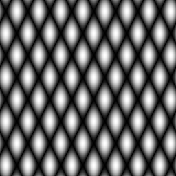

# Capítulo 5 - Serialização de dados em ponto flutuante via FileStorage

Exercicio 5.1

> Utilizando o programa-exemplo filestorage.cpp como base, crie um programa que gere uma imagem de dimensões 256x256 pixels contendo uma senóide de 4 períodos com amplitude igual 127 desenhada na horizontal, semelhante àquela apresentada na Figura 11, “Saída do programa filestorage”. Grave a imagem no formato YML e também em formato PNG, como faz o programa-exemplo. Compare os arquivos gerados, extraindo uma linha correspondente de cada imagem gravada e comparando a diferença entre elas. Trace um gráfico da diferença calculada ao longo da linha correspondente extraída nas imagens. O que você observa? Por que isso acontece?

## Discussão

A seguir estão as imagens geradas contendo a senóide desenhada na vertical e na horizontal, bem como a imagem que mostra as diferenças entre as duas senóides.

| sin(x) (T=8) | sin(y) (T=4) | \|sin(x) - sin(y)\| |
|-----------|-----------|-----------|
|  |  |  |

Observo que o resultado da diferença entre as duas senoides forma um padrão de interferência, onde as regiões claras indicam áreas de maior diferença entre as duas imagens, enquanto as regiões escuras indicam áreas onde as duas senoides são mais semelhantes.

**Curiosidade:** Esse mesmo princípio é a base para criar texturas em computação gráfica