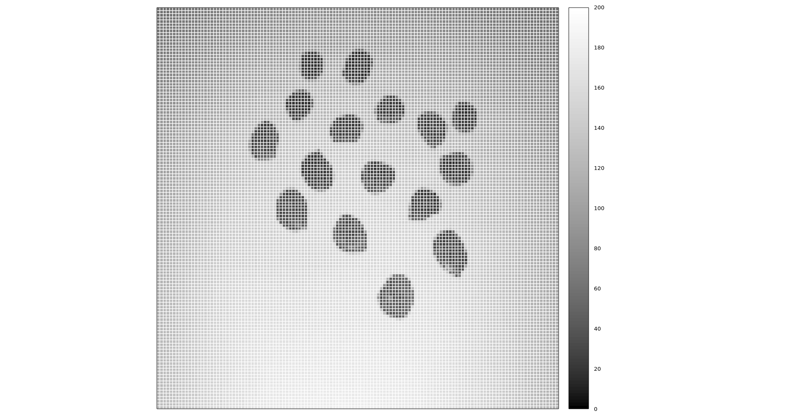
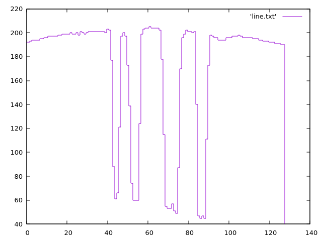
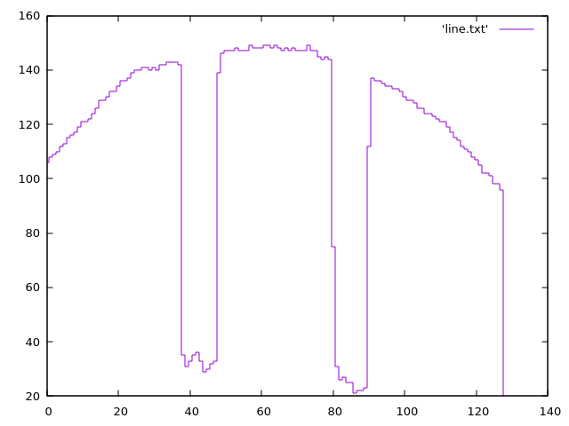

# Capítulo 4 - Visualização de Imagens

Exercício 4.1

> Utilizando o programa da Listagem 10, “visualizacao.cpp” como referência, prepare os arquivos matriz.txt e line.txt para as imagens sementes1.png e sementes2.png mostrada nas Figura 9, “Sementes 1” e Figura 10, “Sementes 2”. Utilize o programa gnuplot para realizar as visualizações mostradas nessa lição para ambas as imagens. Compare os gráficos gerados e discuta o que pode ser observado acerca da iluminação das cenas nas duas imagens.

## Discussão

A seguir os plot das matrizes de intensidade de pixels e dos gráficos de linhas centrais de intensidade para as imagens sementes1.png e sementes2.png.

| sementes1.png | sementes2.png |
|-----------|-----------|
|  |  |
|  |  |

Percebemos que a linha central de intensidade da imagem **sementes2.png** apresenta variações abaixo de 140 unidades por ter uma iluminação mais pobre, enquanto a linha central de intensidade da imagem **sementes1.png** apresenta variações que alcançam até 200 unidades, indicando uma iluminação mais forte.

A imagem **sementes2.png** apresenta uma iluminação mais uniforme e menos intensa em comparação com a imagem **sementes1.png**.